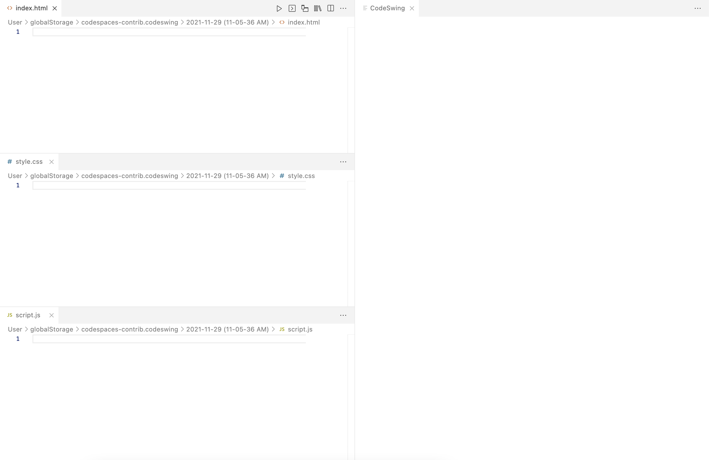

# Create an HTML page

HTML stands for Hypertext Markup Language, and is used to "markup" the text to be displayed on a webpage. More specifically, HTML is used to describe the importance of the text in a page. With HTML you can indicate a header, create a link to another page, or indicate where an image should be placed.

HTML consists of what are called "tags" or "elements". While there is a technical difference between the two, you will find many developers use the terms interchangeably and generally doesn't impact how we create our code. These tags are read by a browser, and used to determine how to display and interpret the information in a page.

We will begin creating our resume by creating an HTML file and adding the code. You may notice the page won't appear to be very structured or robust; we will make it look better when we add our CSS.

## Create the HTML and CSS files with CodeSwing

We will use CodeSwing to create and edit our HTML and CSS in Visual Studio Code. CodeSwing has a variety of templates you can use, and includes support for advanced pages as well. Let's start by creating our first "swing" and using the core HTML/CSS/JavaScript template.

1. Create a folder on your desktop, or another location, to store your files
1. In Visual Studio Code, select **File** > **Open Folder**
1. Navigate to the folder you created and select **Select Folder**
1. Open the command pallette by using **Ctl - Shift - P** (or **Cmd - Shift - P** on a Mac)
1. Type **CodeSwing**
1. Select **CodeSwing: New Swing in Directory..**
1. Select **OK**
1. Select **Basic: HTML/CSS/JavaScript**
1. Your new swing appears, with three files open on the left (HTML, CSS and JavaScript), and a browser window on the right

    

1. Notice how three files were created - **index.html**, **style.css** and **script.js**
1. Select the **x** next to **script.js** to close the JavaScript window as we won't be using JavaScript in this workshop

> **IMPORTANT** If you accidentally close the wrong windows, you re-open CodeSwing by returning to Visual Studio Code, open the command pallette with **Ctl - Shift - P** (or **Cmd - Shift - P** on a Mac), typing **CodeSwing**, selecting **CodeSwing: Open Swing...**, and selecting the directory with your files.

You now have the files created for your resume site!

## Create the HTML structure

Let's start adding the HTML for our page. Every HTML page includes three main tags - `html` which contains all the HTML, `head` which includes information about the page, and `body` which contains the contents to display on the page. Tags can also contain **attributes**, which allow us to change how a tag behaves. Attributes are key/value pairs such as `rel="stylesheet"`.

> **Note:** You may notice some of the names are a little cryptic or not necessarily intuitive. This is partly due to the history of HTML. HTML was originally used by scientists and academics as a way to structure documents. As a result, the names or abbreviations used might not always be as clear as we might like.

Most tags have an open (<tag>) and a close (</tag>), and contain information. So `<title>Demo title</title>` indicates the title of the page. Others will only have a single tag, such as `<link rel="stylesheet" href="style.css">`. These types of tags behave much like a command, telling the browser to perform a particular task.

> **Tip:** Don't try to memorize every tag available. Just as memorizing a dictionary isn't a good way to learn a spoken language, memorizing a set of keywords isn't going to aid you in your growth as a developer. As you continue to create pages you'll learn more tags and how they behave.

We're going to use these three tags (and a couple of others) to begin the creation of our resume. We'll explain the tags we're using after we create the page.

1. Inside the **index.html** window, add the following code to create the initial structure of your page, replacing **Your Name** with your name:

    ```html
    <html>
    <head>
        <title>Your Name resume</title>
        <link rel="stylesheet" href="style.css">
    </head>
    <body>
        <main>
            <article>
                <section>
                    <h1>Your Name</h1>
                    <!-- email address -->
                </section>
                <section>
                    <h2>Social media</h2>
                    <!-- social media -->
                </section>
            </article>
            <article>
                <section>
                    <h2>Education</h2>
                    <!-- education -->
                </section>
                <section>
                    <h2>Experience</h2>
                    <!-- experience -->
                </section>
            </article>
        </main>
    </body>
    </html>
    ```

1. Notice how as you type (or copy and paste) the browser window on the right automatically updates with the information you've added, displaying **Your Name** and **Experience**

    > **IMPORTANT** Don't forget to replace **Your Name** with your name.

### Exploring the code

We used several tags to display our page. Below is a table talking about each tag and what they mean. As you look at the code, notice the HTML is in all lower case letters, and the use of tabs to create an outline for the code. While this isn't required, it does make your HTML much more readable.

| tag                          | description                                                                                                                                                                                                      |
| ---------------------------- | ---------------------------------------------------------------------------------------------------------------------------------------------------------------------------------------------------------------- |
| `html`                       | Container for all HTML in an HTML page.                                                                                                                                                                          |
| `head`                       | Contains metadata, or information about the page.                                                                                                                                                                |
| `link`                       | Used to tell the page what CSS stylesheet to use. `rel="stylesheet"` indicates we are using a stylesheet, and `href="style.css"` loads **style.css** (which is the name of the stylesheet created by CodeSwing). |
| `title`                      | Indicates the title of the page to display on the toolbar. This is **not** displayed on the page itself. Every page you create should have a title.                                                              |
| `body`                       | The contents of the page to be displayed to the user.                                                                                                                                                            |
| `main`, `article`, `section` | These are "semantic" tags. See the note below for more information.                                                                                                                                              |
| `h1`                         | A level 1 header. Header tags go from `h1` to `h6`, with `h1` being the highest level, to `h6` being the lowest level. These are used to create structure for the outline of the page. |
| `<!-- comment -->` | These are HTML comments. They are useful for making notes or setting reminders to yourself.

> **Note:** Comments are a great way to take notes as you're learning HTML. You can put a comment right above a section of code, and describe what the section does. But do remember comments **are not** secure, so don't store sensitive information in comments.

#### Semantic tags

Semantic tags are a relatively new addition to HTML. You may notice on the page there is a difference in size between `h1` and `h2`. This is because besides just indicating a level, header tags also modify how content is displayed. Semantic tags such as `main`, `article` and `section` are only used to group information together. The main advantage is the ability to structure a large HTML document, and later use CSS to control how the content will actually get displayed.

You can use semantic tags however you wish, but a common hierarchy is:

- `main`
    - `article`
        - `section`

## Summary and next steps

You've now created your first HTML page! Next, let's [add additional content](./2-add-content.md) such as your email address and sections for your experience..
