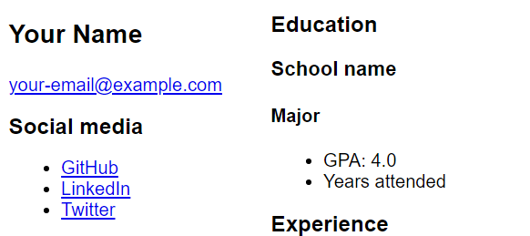
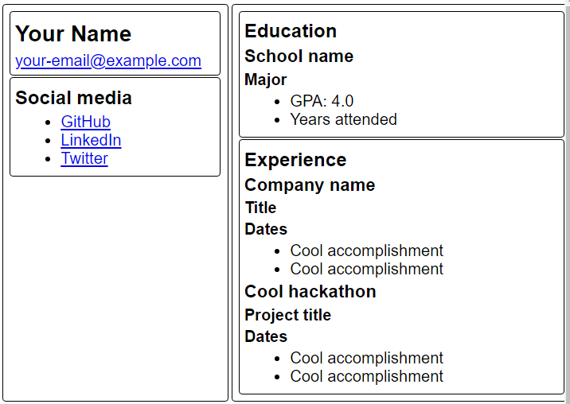

# Location and borders

CSS can be used to control both [how elements are displayed](./add-style.md) and where they are in relation to one another or the page itself. Right now our page flows from top to bottom - the first part of the HTML is displayed at the top, and the last part is at the bottom. By using CSS we can create a grid layout, place borders, and control how close elements are to one another.

## Creating a grid

CSS grids are a relatively new feature. Like the name implies, a grid allows you to place elements on a page much in the same way you might lay things out in a table. You can use grids to create columns and rows for your data.

> **Note:** For accessibility purposes, you should avoid using a table to layout a page unless you are displaying tabular data.

Let's review the structure of your page:

```html
<main>
    <article>
        Name & social media
    </article>
    <article>
        Education & experience
    </article>
</main>
```

We want to create two columns, one for the first `article` with the name and social media information, and the second `article` with education and experience. Notice how both `article` elements are contained inside of a single `main` element. We will use the `main` element as the container for our grid. We will configure `main` to host the grid, and configure two column templates - one for each article.



1. At the bottom of **style.css**, add the following CSS to create the grid

    ```css
    main {
        display: grid;
        grid-template-columns: 40% 60%;
    }
    ```

1. Your page will update displaying the two columns

Notice `grid-template-columns: 40% 60%;`. This is creating two columns, one which will take up 40% of the screen, and the other 60%.

## Controlling spacing with the box model

CSS uses what's known as the box model. The box model controls how information is displayed inside an element, and how close to one another elements are placed. There are 3 key properties - `margin`, `border`, and `padding`. The diagram below indicates how these control content placement.


In this diagram the content is the text **Hello, world**. `padding` is the space between the text and the black `border`. And `margin` is the space between the `border` and the next element.

If you look at where the header and lists are on the page, you will notice there's a significant amount of space between them. This is controlled by the `margin`. We can reduce this by updating the `margin` property of the elements. Let's update the CSS to reduce the spacing between the header elements and the lists.

1. At the bottom of **style.css**, add the following CSS to update the `margin` for the header elements

    ```css
    h1, h2, h3, h4, ul {
       margin-top: .2em;
       margin-bottom: .2em;
    }
    ```

1. The page automatically updates

> **Note:** Notice how we were able to modify multiple elements by listing them with commas: `h1, h2, h3, h4, ul`. The commas are important in this example; leaving them out creates a different CSS selector. Also, `margin-top` and `margin-bottom` sets the margin for the top and bottom respectively. You could also use `margin-left` and `margin-right` to set those values, or provide them all by just using `margin`.

## Adding a border

The last thing we want to do is create some visual separation between the core sections of the page - our `article` and `section` elements. We can do this by setting a border. While every element always has a border, almost all of them don't display it by default. We can use CSS to add in a border, and use `border-radius` to create a rounded corner. You'll also set the `margin` and `padding` to create a bit of spacing between the border and the content and other elements.

1. At the bottom of **style.css**, add the following CSS to add borders and manage spacing

    ```css
    article, section {
        border-radius: .2em;
        border-style: solid;
        border-width: .01em;
        margin: .1em;
        padding: .3em;
    }
    ```

1. The page updates with the final result



